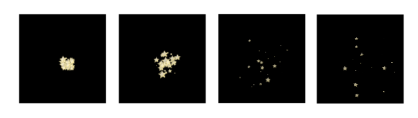
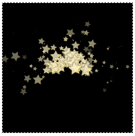
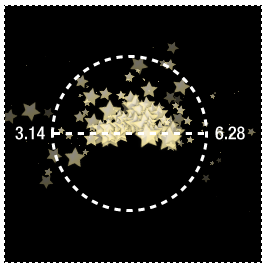

Dust - Particle Effects for Pixi (v3.0.11)
====

Dust is a quick and easy particle effects engine for [Pixi](https://github.com/GoodBoyDigital/pixi.js/).

(Important! This library targets Pixi v3.0.11, which is the most stable version of Pixi, and is the only version I can recommend using. This library will eventually be upgraded for Pixi v4 when the v4 branch matures.)

Table of contents
-----------------

[Setting up](#settingup) <br>
[Making Particles](#particles) <br>
[Using a `ParticleContainer`](#container) <br>
[Customizing the particle options](#customizing) <br>
[Using a particle emitter](#emitter) <br>

<a id="settingup"></a>
Setting up
----------

To get started with Dust, first link the `dust.js` file to to your
HTML page with a script tag, like this:
```
<script src="dust.js"></script>
```

Next, create an instance of Dust at the
beginning of your program. Supply the `PIXI` instance as the
constructor argument.
```
let d = new Dust(PIXI);
```
Then, very importantly, make sure you call Pixi Dust's `update` function inside your game loop. 
```js
function gameLoop() {
  requestAnimationFrame(gameLoop);
  d.update();
}
```
You're now ready to use Dust to make and animate particles.

<a id="particles"></a>
Making particles
----------------
With Dust all set up and running, you can now make particles
using the `create` method. Here's how to create 50 star sprites on the
stage at an x/y position of 128/128. (This code assumes you have a
loaded texture called `star.png`).
```js
let stars = d.create(
  128,                                       //x start position
  128,                                       //y start position
  () => new PIXI.Sprite(                     //Sprite function
    PIXI.utils.TextureCache["star.png"]
  ), 
  stage,                                     //Container for particles
  50                                         //Number of particles
);
```
The first two arguments are the x/y point where the particles will
appear. The third argument is a function that returns the sprite you
want to use for each particle. Use any sprite creation method you
like. If you use a `AnimatedSprite` sprite and supply more than one frame
texture, Dust will randomly display different frames for each particle.
The fourth argument is the container that you want to add the particles to; 
in this example the particles will be added to the stage. The fifth argument 
is the number of particles you want to create. The `create` method returns an array 
containing references to all the sprites being used as particles, which might 
be useful if you need to access them for reasons such as doing collision detection.

This is the effect that this code produces:



The particles appear at the same point with different random sizes and
velocities. They fly away from the center point, randomly changing
scale and alpha, until they all fade away and disappear. Many of the
properties are randomized, so the effect is different every time. You'll see ahead how you can fine 
tune each of these properties to produce exactly the effect you need.
You can drop this code anywhere in your program to create a single
burst of particles, such as a key press or mouse click. 

<a id="particles"></a>
Using a `ParticleContainer`
-------------------------

In the example code above the particles were all added
to the root `stage` container object (the fourth argument.) However,
you can add the particles to any container you like, or to any other
sprite. You can use Pixi's `ParticleContainer` to display a large
number of sprites on screen at a high frame rate. If you want to use
`ParticleContainer` for your particles, just add the name of the
`ParticleContainer` object you want to use in the `create` method's
4th argument. Here's how you could modify the example code above to add
the particles to a `ParticleContainer` called `starContainer`.
```js
//Create the `ParticleContainer` and add it to the `stage`
let starContainer = new PIXI.ParticleContainer(
  15000,
  {alpha: true, scale: true, rotation: true, uvs: true}
);
stage.addChild(starContainer);

//Create star particles and add them to the `starContainer`
let stars = d.create(
  128, 128, 
  () => new PIXI.Sprite(
    PIXI.utils.TextureCache["star.png"]
  ), 
  starContainer,
  50
);
```
`ParticleContainer`s are optimized for pushing many thousands of
sprites, so, unless you're animating that many particles, you probably
won't notice any performance improvement over using ordinary
`Container` objects.

<a id="customizing"></a>
Customizing the particle options
--------------------------------

The `create` method has a total of 19 different parameters you can set
to fully customize how the particles behave. Here's the full parameter
list, with examples of the kinds of values you could use.
```js
let stars = d.create(
  128,                                  //x start position
  128,                                  //y start position
  () => new PIXI.Sprite(                //Sprite function
    PIXI.utils.TextureCache["star.png"]
  ),  
  stage                                 //Container for particles
  50,                                   //Number of particles
  0.1,                                  //Gravity
  true,                                 //Random spacing
  0, 6.28,                              //Min/max angle
  12, 24,                               //Min/max size
  1, 2,                                 //Min/max speed
  0.005, 0.01,                          //Min/max scale speed 
  0.005, 0.01,                          //Min/max alpha speed
  0.05, 0.1                             //Min/max rotation speed
);
```
You can see that most of the parameters describe a range between the
minimum and maximum values that should be used to change the sprites’
speed, rotation, scale, or alpha. You can also specify the number of
particles that should be created, and add optional gravity. 
The minimum and maximum angle values are important for defining the
circular spread of particles as they radiate out from the origin
point. For a completely circular explosion effect, use a minimum angle
of 0 and a maximum angle of 6.28. 
```js
0, 6.28
```
(These values are radians; the equivalent in degrees is 0 and 360.) 0
starts at the 3 o’clock position, pointing directly to the right. 3.14
is the 9 o’clock position, and 6.28 takes you around back to 0 again. 
If you want to constrain the particle range to a narrower angle, just
supply the minimum and maximum values that describe that angle. Here
are values you could use to constrain the angle to a pizza-slice with
the crust pointing left.
```js
2.4, 3.6
```
You could use a constrained angle range like this to create a particle
stream, like those used to create a fountain or rocket engine flames.
(You’ll see exactly how to do this in the example ahead.) The random
spacing value (the seventh argument) determines whether the
particles should be spaced evenly (`false`) or randomly (`true`) within this range. 
By carefully choosing the sprite for the particle and finely adjusting
each parameter, you can use this all-purpose `create` method
to simulate everything from liquid to fire. 

<a id="emitter"></a>
Using a particle emitter
------------------------

The `create` method produces a single burst of particles, but often
you'll need to produce a continuous stream of particles. You can do
this with the help of a **particle emitter**. A particle emitter
produces particles at fixed intervals to produce just such a stream
effect, and you can create one using Dust's `emitter` method. The
emitter has `play` and `stop` methods that let you turn the particle
flow on and off and you can define the interval at which particles are created.
Here's the general format for using Dust's `emitter` method. It
takes two arguments. The first argument is the interval, in
milliseconds, between which burst of particles are created. The second
argument is the same `create` method from the previous examples.
```js
let particleStream = d.emitter( 
  100,                                  
  () => d.create();
);
```
Any interval value of 100 milliseconds or less will make the particles
appear to flow in a continuous stream. Here's some code that produces
a star fountain effect. The stars appear in the center of the canvas,
shoot up, and then cascade down with the pull of gravity. 
```js
let particleStream = pd.emitter(
  100,
  () => particles.create(
    128, 128,
    () => new PIXI.Sprite(
      PIXI.utils.TextureCache["star.png"]
    ),
    stage,
    30,
    0.1,
    false,
    3.14, 6.28,
    16, 32,
    2, 5
  ) 
);
```
This is the effect this code produces:



The sixth argument, 0.1, is the force of gravity. Setting gravity to a
higher number will pull the particles down faster. (Set gravity to 0
to turn it off.) The angle is between 3.14 and 6.28. That makes the
particles appear within a half-moon sized angle above their origin
point. Here's how that angle is defined.



The stars are created at the center origin point then fly up and out
within the upper half of the circle. Gravity is acting on the
particles the entire time, however, so they'll eventually fall towards
the bottom of the canvas. That's what creates the cascading fountain effect.

You can use the emitter's `play` and `stop` methods to turn the particle
stream on or off at any time in your code, like this:
```js
particleStream.play();
particleStream.stop();
```
The particle emitter also has a Boolean `playing` property that will
be `true` when the paricle emitter is playing, and `false` when it's
been stopped.
This is all you need to know to start making particle effects with Dust.


